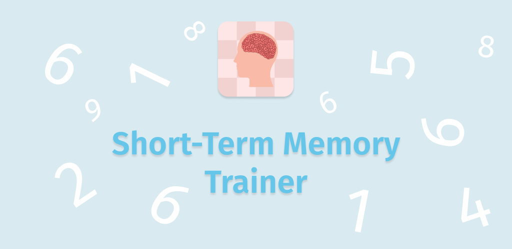
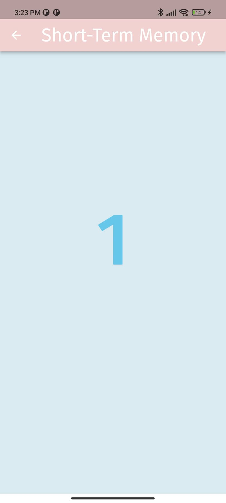

<h1 style="font-weight:normal">
  <a href="https://atasoya.com">
    
  </a>
  &nbsp;Short-Term Memory Trainer&nbsp;
  
  
</h1>
Train your short-term memory
<br>

<p align="center"> 
  
</p>

Screens
========
* Index Screen 
* Start Screen
* Digit Screen
* Answer Screen
* Result Screen

Build 
===========
Start a new [flutter](https://flutter.dev/docs/get-started/test-drive?tab=terminal) app

```
flutter create shorttermmemorytraning
```
<br>

Change your lib folder , pubspec.yaml file and add assets folder.

<br>

Now run the app

```
flutter run 
```

Showcase
========
<center>
  <table>
    <tr>
      <td><a href="https://play.google.com/store/apps/details?id=com.atasoya.shorttermmemorytraning"></a></td>
      <td><a href="https://play.google.com/store/apps/details?id=com.atasoya.shorttermmemorytraning"></a></td>
      <td><a href="https://play.google.com/store/apps/details?id=com.atasoya.shorttermmemorytraning"></a></td>
      <td><a href="https://play.google.com/store/apps/details?id=com.atasoya.shorttermmemorytraning"></a></td>
      <td><a href="https://play.google.com/store/apps/details?id=com.atasoya.shorttermmemorytraning"></a></td>      
    </tr>
  </table>
</center>

Requirements
============
* Flutter

* Dependencies in pubspec.yaml

Download
============
* [Google Play Store](https://play.google.com/store/apps/details?id=com.atasoya.shorttermmemorytraning)

* ~~Apple App Store~~
